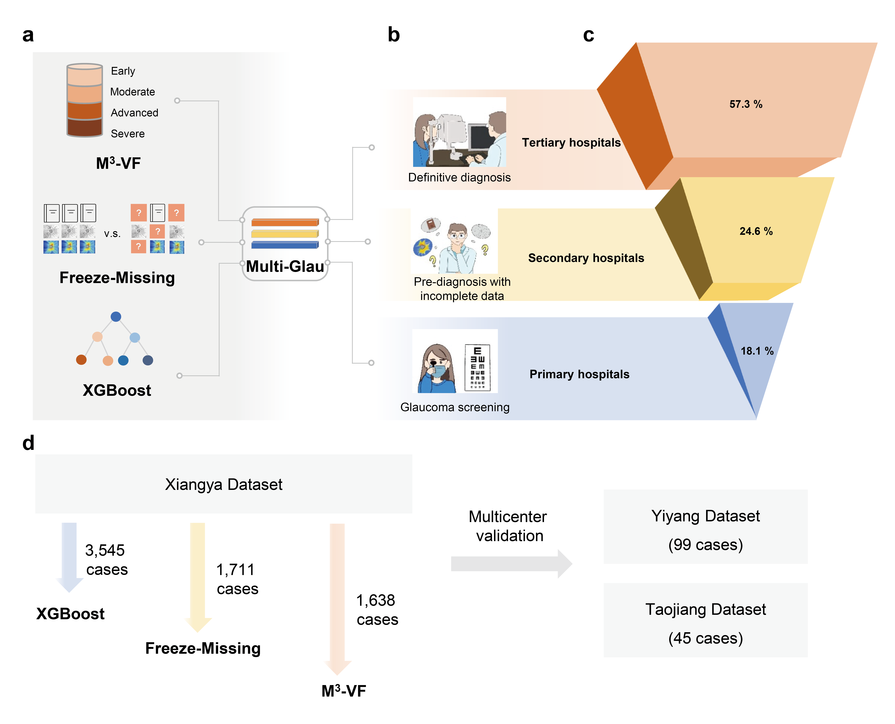

# Multi-Glau
This is the source code for the article **'A three-tier AI solution for equitable glaucoma diagnosis across China’s hierarchical healthcare system '**. 
  
## Abstract
Artificial intelligence (AI) offers a solution to glaucoma care inequities driven by uneven resource distribution, but its real-world implementation remains limited. Here, we introduce Multi-Glau, an three-tier AI system tailored to China's hierarchical healthcare system to promote health equity in glaucoma care, even in settings with limited equipment. The system comprises three modules: (1) a screening module for primary hospitals that eliminates reliance on imaging; (2) a pre-diagnosis module for handling incomplete data in secondary hospitals, and (3) a definitive diagnosis module for the precise diagnosis of glaucoma severity in tertiary hospitals. Multi-Glau achieved high performance (AUC: 0.9254 for screening, 0.8650 for pre-diagnosis, and 0.9516 for definitive diagnosis), with its generalizability confirmed through multicenter validation. Multi-Glau outperformed state-of-the-art models, particularly in handling missing data and providing precise glaucoma severity diagnosis, while improving ophthalmologists' performance. These results demonstrate Multi-Glau’s potential to bridge diagnostic gaps across hospital tiers and enhance equitable healthcare access.  
## TODO

- [x] SHAP.py
- [x] decision.py
- [x] plot.py
- [x] screening module
- [ ] pre-diagnostic module (Writing comments and organizing code)
- [ ] definitive diagnosis module (Writing comments and organizing code)
## Contents

- **SHAP.py**  
  Visualizes the impact of features on the model, specifically highlighting the relative importance of each feature.  
  Reference: [SHAP Library](https://shap.readthedocs.io/en/latest/index.html#)

- **decision.py**  
  Implements the decision curve analysis, a graphical method used to evaluate clinical strategies by assessing net benefit across different probability thresholds (*Pthreshold*).  
  The x-axis represents the range of possible thresholds, while the y-axis indicates the corresponding net benefit.
- **plot.py**  
  Provides demonstration code for generating violin plots, pie charts, and KDE (Kernel Density Estimation) plots using `seaborn` and `matplotlib`. Due to the sensitivity of the original clinical data, it cannot be publicly shared. Therefore, all data in this script are randomly generated solely for visualization demonstration purposes. You are encouraged to replace the synthetic data with your own dataset and customize the plotting style as needed for your research or publication.
- **screening_model.py**  
  This script trains a screening model using XGBoost with Bayesian Optimization and stratified k-fold cross-validation. It saves the best model for each fold and records both validation and external test metrics.
## Data availability
Due to healthcare data management policies, the data used in this study cannot be made publicly accessible. However, the Multi-Glau discussed in this paper are generic and can be used as long as the input consists of medical images and structured numerical data.

