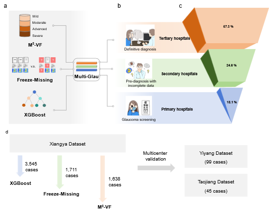

# Multi-Glau
This is the source code for the article 'A three-tier AI solution for equitable glaucoma diagnosis across China’s hierarchical healthcare system '. 

## Contents

- **SHAP.py**  
  Visualizes the impact of features on the model, specifically highlighting the relative importance of each feature.  
  Reference: [SHAP Library](https://shap.readthedocs.io/en/latest/index.html#)

- **decision.py**  
  Implements the decision curve analysis, a graphical method used to evaluate clinical strategies by assessing net benefit across different probability thresholds (*Pthreshold*).  
  The x-axis represents the range of possible thresholds, while the y-axis indicates the corresponding net benefit.

> ⚙️ Code for the screening model is currently being organized and annotated. It will be uploaded by **June 15, 2025 (Beijing Time)**.

## Data availability
Due to healthcare data management policies, the data used in this study cannot be made publicly accessible. However, the Multi-Glau discussed in this paper are generic and can be used as long as the input consists of medical images and structured numerical data.

